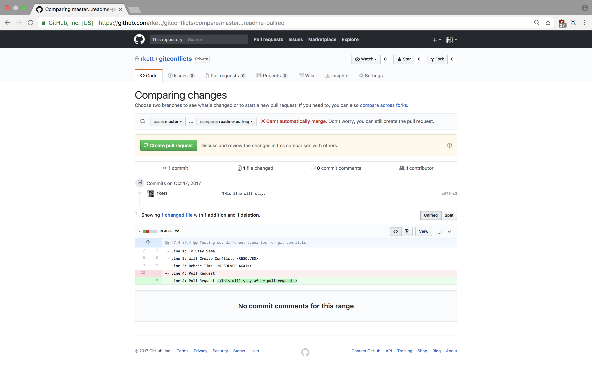
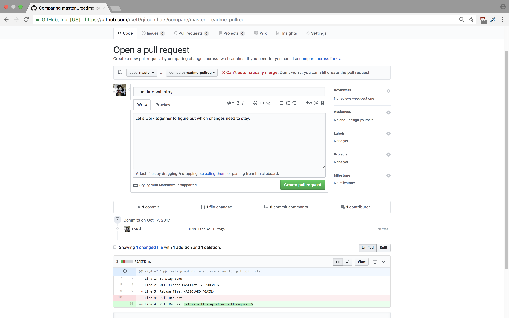
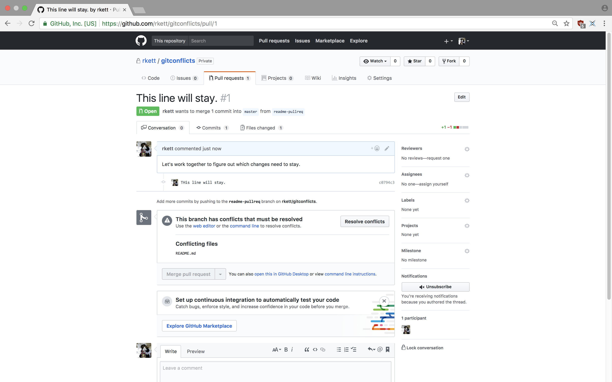
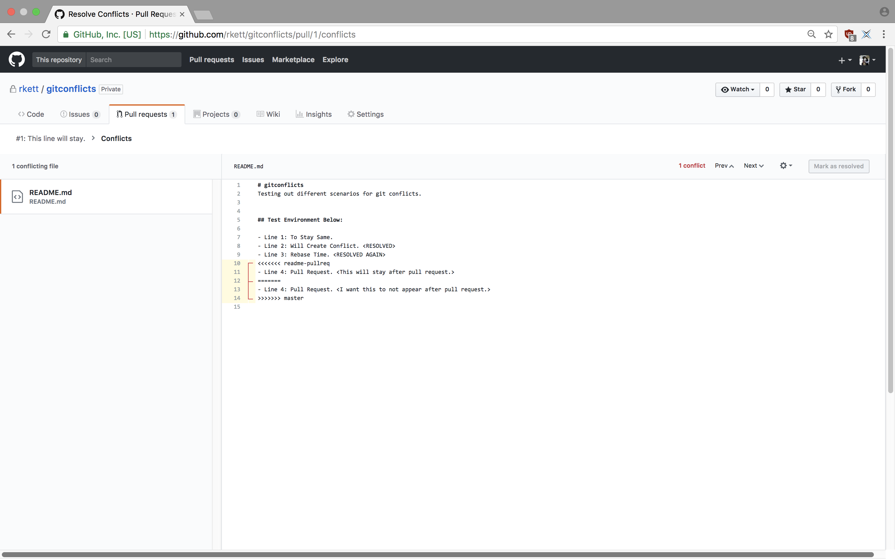
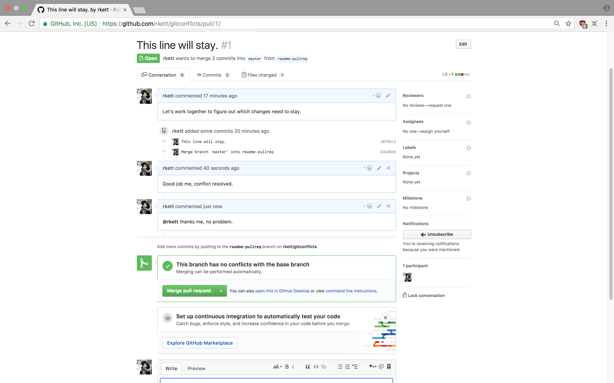
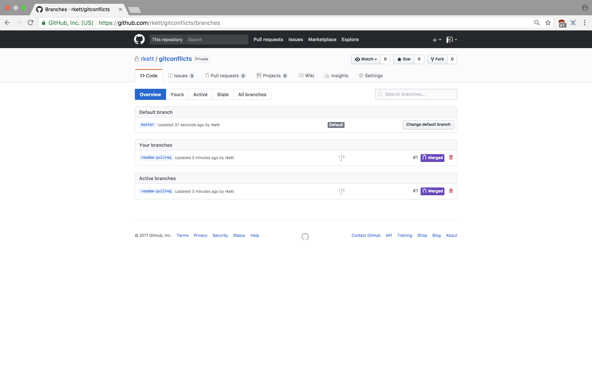

class: center, middle, title-slide

# Git Continued: Merging and Conflicts

---

# Topic Overview

- Local Merging
- Local Rebasing
- Diff
- Merge/Rebase Conflicts w/ Resolution
- Pull Requests

---

# Quick Recap of Last Git Lab

## Commands to remember:
- Making a branch

```bash
$ git branch <branch_name>
```

- Switching to a branch

```bash
$ git checkout <branch_name>
```

- Shortcut:

```bash
git checkout -b <branch_name>
```

> This is equivalent to creating and switching to a branch at the same time !

---

# Merging Example

> **Note** If you feel like re-creating this example, or playing around with it. I've just done this by creating a repo on github with a readme, cloned it locally, and then proceeded with the following steps.

I've made a README.md with the following lines:

```text
- Line 1: To Stay Same.
- Line 2: Will Create Conflict.
```

This will be our basis for this example and the next one. From there, track this file, and commit.
Now, **switch** to a newly made branch:

```bash
$ git checkout -b readme-fix
```

Edit README.md to show something like:

```text
- Line 1: To Stay Same.
- Line 2: Will Create Conflict. <Change on readme-fix.>
```

---

# Merging Example Continued:

Now, stage and commit this change, then, switch back to **master** and do the same, like so:

```text
- Line 1: To Stay Same.
- Line 2: Will Create Conflict. <Change on master.>
```

> **Note** We have generated a *divergent* commit history, with a conflict. 

Let's try to **merge** (in this case we are merging readme-fix into master) !

```bash
$ git merge readme-fix
Auto-merging README.md
* CONFLICT (content): Merge conflict in README.md
Automatic merge failed; fix conflicts and then commit the result.
```

---
# A Quick Pause

Before attempting to resolve this, let's take a look at the status of our local repo:

```bash
$ git status
On branch master
Your branch is ahead of 'origin/master' by 1 commit.
  (use "git push" to publish your local commits)
You have unmerged paths.
  * (fix conflicts and run "git commit")
  * (use "git merge --abort" to abort the merge)

Unmerged paths:
  (use "git add <file>..." to mark resolution)

  both modified:   README.md

no changes added to commit (use "git add" and/or "git commit -a")
```
> **Note** At any point a merge conflict is introduced, as git has outlined for us, you may abort the merge, or 
  delve into conflict resolution, which is only truly *resolved* when the changes are *added* !

---

# A Quick Pause p2

If you want to get an even deeper understanding, or if you would like to check certain changes accross branches, commits, or even across your HEAD pointer you can make use of the git diff command. From our current example:

```bash
$ git diff readme-fix
diff --git a/README.md b/README.md
index edd4a68..21bab23 100644
--- a/README.md
+++ b/README.md
@@ -5,4 +5,4 @@ Testing out different scenarios for git conflicts.
 ## Test Environment Below:
 
 - Line 1: To Stay Same.
-- Line 2: Will Create Conflict. <Edited on readme-fix branch>
\ No newline at end of file
+- Line 2: Will Create Conflict. <Edited on master branch>
\ No newline at end of file
```

---

# A Quick Pause p3

This is a comparison between the lastest commit on the master branch versus the latest commit on the readme-fix branch. Even before merging we are able to see that *line 2* has conflicting changes on it, while this is not explictly highlighted by git, it can help with pre-emptive changes. Further more, git diff can be used as such:

- Comparing HEAD to last commit (will show nothing if no changes since last commit.)
```bash
$ git diff
```

- Comparing commits
```bash
git diff <commit A> <commit B>
```

> **Note** These are a few examples, most git commands have an incredible amount of utility/options, git diff is a powerful tool for doing quick comparisons across versions of your code.

---

# Resolving Our Conflict:

Take a look at the file in question:
```text
- Line 1: To Stay Same.
<<<<<<< HEAD
- Line 2: Will Create Conflict. <Edited on master branch>
=======
- Line 2: Will Create Conflict. <Edited on readme-fix branch>
>>>>>>> readme-fix
```

In preparation, we know which changes were added on which branch. However, note that the top line is associated with HEAD, this is because our HEAD is on the master branch. We could have merged from a different location and the conflict would change the name accordingly. 

I choose to resolve this by replacing the lines with:

```text
- Line 2: Will Create Conflict. <Conflict Resolved>
```

---

# Resolving Our Conflict p2

As we saw early, to truly resolve the conflict, use git add on the files in question, and finally, commit the changes.

Visually, we may see the merge like so:

```bash
$ git log --oneline --decorate --graph --all
.   b36794f (HEAD -> master) Conflict resolved while trying to merge from readme-fix into master.
|\  
| . 98f9d57 (readme-fix) Added a change to 'line 2' of readme.md.
. | 4992284 Added a change to 'line 2' of readme.md
|/  
. 9cdaf26 (origin/master, origin/HEAD) Added text to readme.md.
. 2aabc91 Initial commit
```

> ***nice.***
---

# Another Approach: Rebasing

Starting from a divergent history again (this time with a new branch, readme-rebase):

```bash
$ git log --oneline --decorate --graph --all
. 4b116ef (HEAD -> master) Added different text to 'line3' while on master branch.
| . a1548b3 (readme-rebase) Added extra text to 'line3' on readme.md.
|/ 
...
```

Once again I've added two different peices of text to the same line.

Let's rebase readme-fix onto master:

```bash
git checkout master
git rebase readme-fix
```

This will apply the changes made to readme-fix onto the commits from master and throw readme-fix ahead of master.
---

# Rebase p2

Once again, on purpose, we have introduced a conflict between files in their respective commits:

```text
<<<<<<< HEAD
- Line 3: Rebase Time. <Let's test this rebase out.>
=======
- Line 3: Rebase Time. <This change will be rebased.>
>>>>>>> Added extra text to 'line3' on readme.md.
```

Let's see what git has to say:

```bash
$ git status
* rebase in progress; onto 4b116ef
You are currently rebasing branch 'readme-rebase' on '4b116ef'.
  (fix conflicts and then run "git rebase --continue")
  (use "git rebase --skip" to skip this patch)
  (use "git rebase --abort" to check out the original branch)

Unmerged paths:
  (use "git reset HEAD <file>..." to unstage)
  (use "git add <file>..." to mark resolution)

  both modified:   README.md

no changes added to commit (use "git add" and/or "git commit -a")
```
---

# Rebase p3

Following the previous instructions given by git (ie. fixing conflict) run:

```bash
$ git rebase --continue
```
and now, let's check the commit history:

```bash
$ git log --oneline --decorate --graph --all
. e14b7dd (HEAD -> readme-rebase) Added extra text to 'line3' on readme.md.
. 4b116ef (master) Added different text to 'line3' while on master branch.
. a500cdf (origin/master, origin/HEAD) Added 'line3' to readme.md.
...
```

> ***interesting.***

---

# Rebase p4

You'll notice two strange things, let's compare merge vs. rebase:

- Merge:
```bash
$ git log --oneline --decorate --graph --all
.   b36794f (HEAD -> master) Conflict resolved while trying to merge from readme-fix into master.
|\  
| . 98f9d57 (readme-fix) Added a change to 'line 2' of readme.md.
. | 4992284 Added a change to 'line 2' of readme.md
|/  
. 9cdaf26 (origin/master, origin/HEAD) Added text to readme.md.
. 2aabc91 Initial commit
```

- Rebase:
```bash
$ git log --oneline --decorate --graph --all
. e14b7dd (HEAD -> readme-rebase) Added extra text to 'line3' on readme.md.
. 4b116ef (master) Added different text to 'line3' while on master branch.
. a500cdf (origin/master, origin/HEAD) Added 'line3' to readme.md.
...
```

***Question***: Where did the branch go ? Where is master pointing ?

---

# Some Answers

As was stated earlier rebase applies commits done on a branch *onto* the commits you are rebasing. 
Then, it places the branch pointer ahead of the branch whom you have rebased onto. The final step for our example here is to
perform a "fast forward" merge, wherein we merge upwards on the commit history:


```bash 
$ git merge readme-rebase
Updating 4b116ef..e14b7dd
Fast-forward
 README.md | 2 +-
 1 file changed, 1 insertion(+), 1 deletion(-)
```

 and looking at the logs again:

 ```bash
 $ git log --oneline --decorate --graph --all
*. e14b7dd (HEAD -> master, readme-rebase) Added extra text to 'line3' on readme.md.
. 4b116ef Added different text to 'line3' while on master branch.
. a500cdf (origin/master, origin/HEAD) Added 'line3' to readme.md.
```

now, master and readme-rebase are both pointing to the top of the commit history,
then rebase has generated a ***linear*** commit log, IE. our changes appear to be linear in ordering.

---

# Merging on the server: pull requests.

As an example, assume I've done the same as the other examples to readme.md, and now I've pushed those changes to the remote master and another branch readme-pullreq, both are now served to my repo gitconflicts. Server side git has a plethora of workflow styles. So far, in this class we have opted to ignore 'forking' and instead stuck with pushing changes to the main repo in the form of branches. For both types however, we may merge our branches into the main remote branch by utilizing a feature known as **pull requests**.

**Note** There are many ways to provide the changes you have completed to the remote master branch:
- Merging locally into your master, which is tracking the remote master and then pushing.
- Tracking the remote master on your branches upstream and pushing.

There are others as well, however, if you want to utilize strong history tracking, using pull requests is likely the optimal way.

---

# Pull Requests 2

A pull request is simply you asking the server owner, or repo owner to proceed with a server-side **pull** across two branches or forks on their server-side repo. Remembering that you may think of a pull as a *fetch* and *merge* in one step. IE. We fetch the data across one branch and merge it into the other. In the case of your assignment, you will all want to be requesting pulls into your remotes master branch.

In the theme of this lab though, you will encounter conflicts here as well!

> ***yay!***

---
class: left-image-resize-3

# Pull Requests p3

Creating a pull request:



---

class: left-image-resize-3

# Opening Pull Request



---

class: left-image-resize-3

# Before Resolving



---

class: left-image-resize-3

# Resolving



---

class: left-image-resize-3

# After Resolving



---

class: left-image-resize-3

# Complete !




